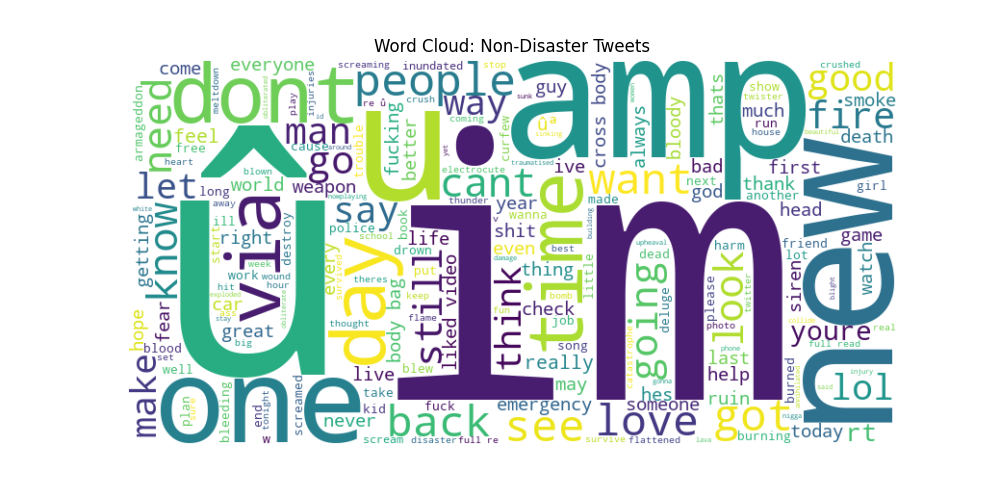

### NLP Text Classification for Disaster Tweets(Kaggle Competition)

## Competition Description
This competition focuses on classifying tweets that are related to real-world disasters. The challenge is to predict whether a tweet is about a real disaster or not based on its content. The dataset consists of 10,000 tweets that were hand-labeled as disaster-related or not, and the goal is to build a machine learning model capable of distinguishing between the two categories.

## Goal
The goal of this project is to predict whether a tweet is related to a real disaster or not. The target variable in the dataset is target, which takes values 1 for disaster-related tweets and 0 for non-disaster-related tweets.

---

## 📌 Step-by-Step Breakdown

### 🔹 Step 1: Data Loading and Cleaning

- Loaded `train.csv` and `test.csv`.
- Cleaned the text:
  - Lowercased text
  - Removed URLs, HTML tags, punctuations, digits, etc.
  - Removed stopwords

**Why?**  
Raw tweets contain a lot of noise. Cleaning is essential to reduce dimensionality and increase signal-to-noise ratio.

---

### 🔹 Step 2: Exploratory Data Analysis (EDA)

EDA was performed to understand the distribution and characteristics of the text data.

#### 📊 Tweet Length Distribution

- Tweets vary between 20 to 140 characters.
- Disaster tweets tend to be slightly longer.

#### ☁️ Word Clouds
**Disaster Tweets**

**Non-Disaster Tweets**

#### 🔤 Common Words

**Across All Tweets**  

**Disaster Tweets**  

**Non-Disaster Tweets**  

**Why?**  
Visual patterns help identify discriminative keywords like "fire", "help", etc., more prevalent in disaster tweets.

---

### 🔹 Step 3: Text Vectorization

Used **TF-IDF Vectorizer** to convert text to numerical format.

- Max features: 10,000
- n-gram range: (1,2)
- Removed English stopwords

**Why?**  
TF-IDF provides more weight to unique words across the corpus, capturing the importance of words in context.

---

### 🔹 Step 4: Model Building and Evaluation

Used **XGBoost Classifier** as the base model.

#### 🔧 Hyperparameter Tuning
Performed using `GridSearchCV` to find optimal:
- `max_depth`
- `n_estimators`
- `learning_rate`

#### 📉 Confusion Matrix (Default Threshold = 0.5)

#### 🩺 ROC-AUC Curve

- **ROC AUC Score**: `0.839`
- **Why?**  
  ROC-AUC captures the balance between sensitivity and specificity.

---

### 🎯 Threshold Tuning

We tested different probability thresholds to optimize **recall** vs **precision** trade-off.

#### Confusion Matrix @ Threshold = 0.3

- Threshold tuning helps improve recall for disaster tweets (class 1) by shifting the decision boundary.
- **Recall for class 1 increased from 0.63 → 0.81**, sacrificing some precision.

---

### 🧠 Sentiment Score Analysis

Used **TextBlob** to analyze tweet sentiment:

- **Polarity**: how positive or negative
- **Subjectivity**: how factual or opinion-based

**Distributions:**
- Polarity:  
  

- Subjectivity:  
  

**Why?**  
It’s a soft feature engineering technique to enhance insight and may be added as a feature later.

---

### 🔹 Step 5: Final Submission

- Predictions made on test data
- Output saved to `submission.csv`
- Submitted to Kaggle

⏱ **Rank Achieved**: 928 / 1077

---

## 🖥 Streamlit Web App

A clean interactive interface for the model.

### Usage:
- Run with: `streamlit run app/app.py`
- Input a tweet → Get prediction + confidence

📦 Model & vectorizer are loaded from `.pkl` files.

---

## 🛠 Technologies Used

- Python, Pandas, NumPy
- Scikit-learn
- XGBoost
- TextBlob
- Matplotlib, Seaborn
- Streamlit
- Jupyter Notebook

---

## 📈 Future Improvements

- Use more advanced models like LSTM or BERT
- Add geographical features if available
- Use POS tagging and NER to enrich features

---

## 📬 Acknowledgments

Thanks to [Kaggle](https://www.kaggle.com/competitions/nlp-getting-started) and the open-source community.

---

## 🧾 License

This project is open-source and free to use.

